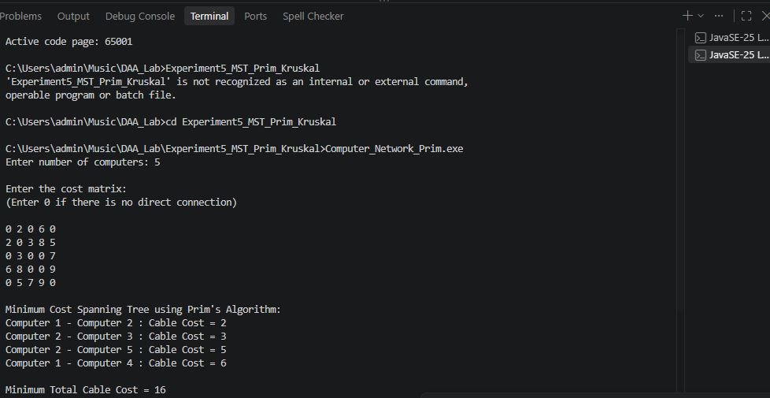
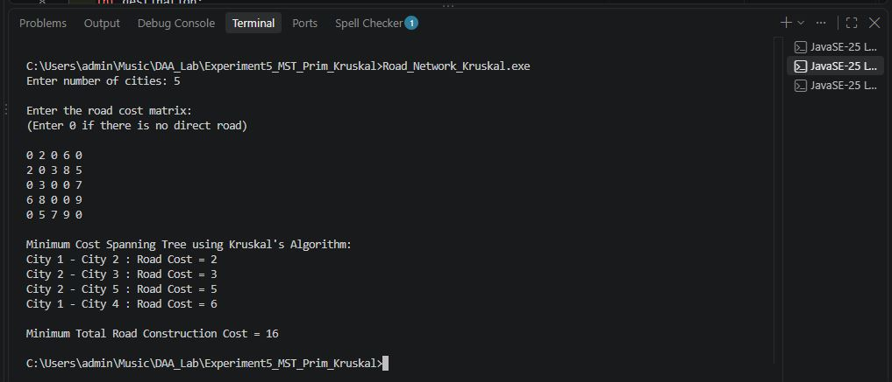
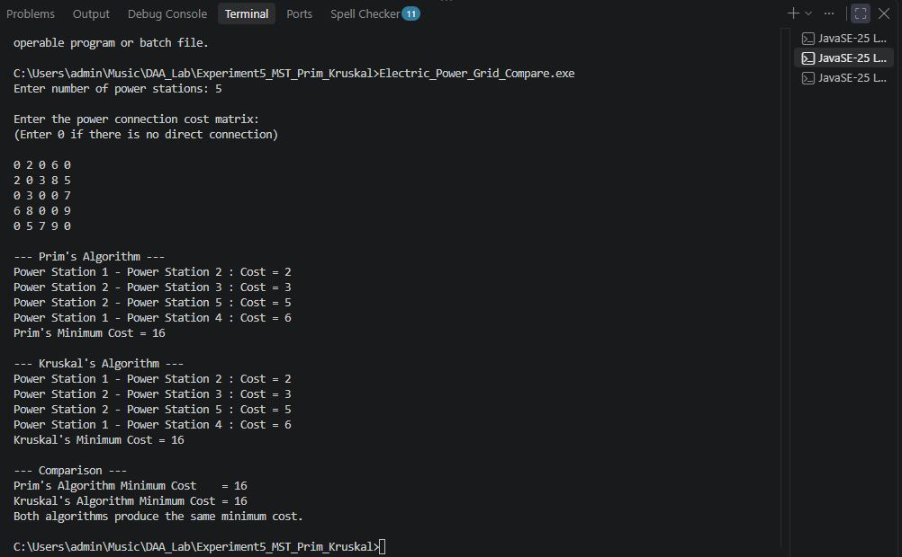

# Experiment No. 5 — Minimum Cost Spanning Tree Using Prim's and Kruskal's Algorithms

## Aim

To implement the **Minimum Cost Spanning Tree (MST)** of a given undirected graph using **Prim's Algorithm** and **Kruskal's Algorithm** and compare their results.

---

## Objective

* To understand the concept of Minimum Cost Spanning Tree.
* To implement Prim's Algorithm.
* To implement Kruskal's Algorithm.
* To apply MST algorithms to real-world applications.
* To compare the results of Prim's and Kruskal's Algorithms.
* To analyze the time and space complexity.

---

## Theory

A **Minimum Spanning Tree (MST)** is a spanning tree of a connected, weighted and undirected graph that connects all vertices with minimum possible total edge cost.

A spanning tree contains:

```text
Number of Edges = Number of Vertices - 1
```

Two commonly used algorithms for finding MST are:

### Prim's Algorithm

Prim's Algorithm starts from any vertex and repeatedly selects the minimum-cost edge that connects a selected vertex to an unselected vertex.

### Kruskal's Algorithm

Kruskal's Algorithm sorts all edges according to their weights and repeatedly selects the smallest edge that does not form a cycle.

---

# Applications

### 1. Computer Network Cable Connection

Prim's Algorithm is used to find the minimum total cable cost required to connect multiple computers.

**Source File:** `Computer_Network_Prim.c`

### 2. Road Network Construction

Kruskal's Algorithm is used to find the minimum total road construction cost required to connect different cities.

**Source File:** `Road_Network_Kruskal.c`

### 3. Electric Power Grid Connection

Both Prim's and Kruskal's Algorithms are implemented and compared to connect power stations with minimum total connection cost.

**Source File:** `Electric_Power_Grid_Compare.c`

---

# Application 1 — Computer Network Cable Connection

The program uses **Prim's Algorithm** to connect multiple computers using minimum total cable cost.

### Algorithm

1. Read the number of computers.
2. Read the cable cost matrix.
3. Start from the first computer.
4. Select the minimum-cost edge connecting a selected computer to an unselected computer.
5. Add the selected edge to the Minimum Spanning Tree.
6. Repeat until all computers are connected.
7. Display the minimum total cable cost.

### Source File

`Computer_Network_Prim.c`

### Output



---

# Application 2 — Road Network Construction

The program uses **Kruskal's Algorithm** to connect different cities with minimum total road construction cost.

### Algorithm

1. Read the number of cities.
2. Read the road cost matrix.
3. Store all available roads as edges.
4. Sort the edges according to their cost.
5. Select the smallest edge.
6. Check whether the edge forms a cycle.
7. If it does not form a cycle, add it to the Minimum Spanning Tree.
8. Repeat until all cities are connected.
9. Display the minimum total road construction cost.

### Source File

`Road_Network_Kruskal.c`

### Output



---

# Application 3 — Electric Power Grid Connection

The program implements both **Prim's Algorithm** and **Kruskal's Algorithm** to connect power stations with minimum total connection cost.

### Algorithm

1. Read the number of power stations.
2. Read the power connection cost matrix.
3. Apply Prim's Algorithm.
4. Calculate the minimum total cost.
5. Apply Kruskal's Algorithm.
6. Calculate the minimum total cost.
7. Compare the results of both algorithms.
8. Display the minimum costs obtained by both algorithms.

### Source File

`Electric_Power_Grid_Compare.c`

### Output



---

# Comparison Between Prim's and Kruskal's Algorithms

| Feature          | Prim's Algorithm                           | Kruskal's Algorithm           |
| ---------------- | ------------------------------------------ | ----------------------------- |
| Approach         | Vertex-based                               | Edge-based                    |
| Starting Point   | Starts from a vertex                       | No fixed starting vertex      |
| Main Operation   | Select minimum edge from selected vertices | Select globally smallest edge |
| Cycle Handling   | Not explicitly required                    | Required                      |
| Suitable For     | Dense graphs                               | Sparse graphs                 |
| Data Structure   | Adjacency Matrix                           | Edge List                     |
| Time Complexity  | O(V²)                                      | O(E²) in this implementation  |
| Space Complexity | O(V²)                                      | O(E + V)                      |

---

# Time Complexity

## Prim's Algorithm

The adjacency matrix implementation used in this experiment has:

```text
Time Complexity = O(V²)
```

## Kruskal's Algorithm

The edges are sorted using Bubble Sort in this implementation.

```text
Sorting Time Complexity = O(E²)

Overall Time Complexity = O(E²)
```

Where:

```text
V = Number of Vertices
E = Number of Edges
```

---

# Space Complexity

## Prim's Algorithm

```text
Space Complexity = O(V²)
```

## Kruskal's Algorithm

```text
Space Complexity = O(E + V)
```

---

# Advantages

* Finds the Minimum Spanning Tree of a connected weighted graph.
* Reduces the total connection cost.
* Useful in network design and infrastructure planning.
* Prim's Algorithm works well for dense graphs.
* Kruskal's Algorithm works well for sparse graphs.
* Both algorithms produce the same minimum MST cost for a given graph.

---

# Limitations

* The graph must be connected to obtain a complete MST.
* Kruskal's Algorithm requires sorting of edges.
* Prim's adjacency matrix implementation requires more memory for large graphs.
* The implementation uses simple arrays instead of advanced data structures.

---

# Applications

Minimum Spanning Tree algorithms are used in:

* Computer Network Design
* Road Network Construction
* Electric Power Grid Design
* Telecommunication Networks
* Water Pipeline Networks
* Railway Network Planning
* Cable Network Design
* Internet Infrastructure
* Network Optimization

---

# Conclusion

The **Minimum Cost Spanning Tree** was successfully implemented using **Prim's Algorithm** and **Kruskal's Algorithm**.

Three real-world applications were implemented:

1. Computer Network Cable Connection
2. Road Network Construction
3. Electric Power Grid Connection

The results of Prim's and Kruskal's Algorithms were compared. Both algorithms produced the **same minimum total cost** for the given graph.

Thus, both algorithms can be effectively used to find the **Minimum Spanning Tree** of a weighted undirected graph.
